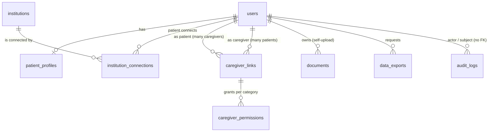

# MedVault — Application Database Schema

*PostgreSQL · schema `medvault` · migrations via Alembic · RLS enforced (ADR-02)*

**Sources analysed:** Technical Requirements Specification v1.1, Epics and Stories, Backend & Frontend Task Breakdown, Master Test Plan v2.0, MedVault-FHIR-Mock-Structure, Categories of medical documents, Sitemap, user-flow diagrams (Connection Flow, Connect Hospitals, Account management, Caregiver Account management, Medical Records Overview), Frontend Stack, DAS internship requirements.

---

## 0. Guiding decision: the app stores only self-uploaded documents

Medical data from institutions (public and private) is **not persisted** in this database. It is fetched live from the mock institutional API (see `MedVault-Mock-API-Database-Schema.md`) every time the patient or a permitted caregiver opens a category page, and rendered without being written to PostgreSQL or MinIO.

What this database *does* store:

| Area | Tables |
|---|---|
| Identity & auth | `users`, `patient_profiles` (Redis holds sessions, SMS codes, OAuth state, rate limits) |
| Institution catalogue & connections | `institutions`, `institution_connections` |
| Caregiver access | `caregiver_links`, `caregiver_permissions` |
| Self-uploaded documents | `documents` |
| Export | `data_exports` |
| Audit | `audit_logs` |

**Consequences to update in the existing docs** (these currently say data is ingested and stored):

- FR4 — "Observation resources are automatically ingested and stored" → should become "fetched on demand, not stored".
- ADR-04 — the `institution_connection_id` column on `documents` and the `source` column are no longer needed: every row in `documents` is by definition self-uploaded.
- Test plan TC-FUNC-03 — "resurse Observation ingerate" → "resources fetched and displayed".
- Story 2.8 (data source per record) — institutional records get their source label from the connection used to fetch them; self-uploads are labelled "Self-uploaded".
- Revocation (FR5 / TC-SEC-11) becomes simpler: once a connection is revoked, no institutional data remains in MedVault at all.
- Caregiver permissions for institutional data cannot be enforced by RLS (the rows aren't in the DB). They are enforced in the API layer before proxying, using the same `caregiver_permissions` table. RLS still enforces them for `documents`.

---

## 1. Shared enums

The six categories follow the *Categories of medical documents* structure. They are the unit of caregiver permission (Epic 3, Story 1) and of self-upload categorisation (Epic 4, Story 1).

```sql
-- The six data categories. One enum shared by caregiver permissions, document
-- categorisation and data exports, so "which data" means the same thing everywhere.
CREATE TYPE medvault.data_category AS ENUM (
  'diagnoses',        -- 1. Diagnoses: medical history, notes, diagnosis records, exam/consult reports (Epics doc: "Diagnostics")
  'certificates',     -- 2. Certificates: listed separately because they can reveal a diagnosis directly (Story 2.4)
  'analyses',         -- 3. Analyses and lab reports: lab panels, imaging, ECG, endoscopy, operative reports
  'prescriptions',    -- 4. Prescriptions: prescriptions, medication records, treatment plans (Story 2.2)
  'patient_info',     -- 5. Patient's info: profile data (weight/height); a permission scope, not an upload category
  'other_med_info'    -- 6. Other med info: hospitalization, pregnancy, allergies, immunizations, referrals (Epics doc: "Details")
);

-- Fixed subtype vocabulary for self-uploaded documents. Labels and translations are application
-- data, while the database enum guarantees that only supported subtype codes are stored.
CREATE TYPE medvault.document_type AS ENUM (
  'medical_history', 'surgical_history', 'family_history', 'progress_note',
  'diagnosis_record', 'medical_examination_report', 'consultation_report',
  'disability_certificate', 'illness_certificate', 'fitness_certificate',
  'vaccination_certificate', 'birth_certificate', 'hospitalization_certificate',
  'medical_examination_certificate', 'pregnancy_certificate', 'health_certificate',
  'blood_test', 'urinalysis', 'biochemistry_report', 'hormone_test',
  'microbiology_report', 'pathology_report', 'xray_report', 'ultrasound_report',
  'ct_report', 'mri_report', 'ecg_report', 'endoscopy_report',
  'radiology_images', 'operative_report',
  'prescription', 'medication_record', 'treatment_plan', 'procedure_record',
  'hospitalization_record', 'discharge_summary', 'pregnancy_record',
  'allergy_record', 'immunization_record', 'referral'
);

-- Account lifecycle. Gates sign-in in one place instead of scattered boolean flags.
CREATE TYPE medvault.user_status AS ENUM (
  'pending_verification',  -- signed up but SMS code not yet confirmed; account inactive (Story 1.4)
  'active',                -- verified, may sign in
  'locked',                -- administrative lock (brute-force lockouts are temporary and live in Redis)
  'disabled'               -- account closed/suspended; kept for audit references
);

-- Institution kind. Decides how the patient reaches it in the UI.
CREATE TYPE medvault.institution_type AS ENUM (
  'public',   -- offered automatically once the patient enters their IDNP
  'private'   -- only reachable through the "Add institution" button
);

-- How a connection came to exist. Lets the UI and audit distinguish automatic from chosen.
CREATE TYPE medvault.connection_origin AS ENUM (
  'auto_public',  -- created for every public institution after IDNP entry + consent
  'user_added'    -- created when the patient picked a private institution
);

-- Connection state machine. Each state maps to a distinct screen or behaviour.
CREATE TYPE medvault.connection_status AS ENUM (
  'pending_consent',  -- row exists, consent screen not yet accepted; no request sent (Story 4.3)
  'authorizing',      -- consent given, OAuth redirect in progress
  'active',           -- token held; live fetches allowed
  'no_match',         -- institution has no record for this IDNP; patient is informed, nothing imported
  'revoked',          -- patient revoked; tokens wiped (FR5)
  'expired',          -- refresh token expired; patient must reconnect
  'error'             -- unexpected failure; lets the UI offer a retry
);

-- Caregiver link state machine (FR6 names pending / active / revoked).
CREATE TYPE medvault.caregiver_link_status AS ENUM (
  'pending',   -- invited, not accepted: no access yet (TC-FUNC-04)
  'active',    -- accepted: permissions apply
  'rejected',  -- caregiver declined or left ("Reject Recipient" flow)
  'revoked'    -- patient removed access (FR9)
);

-- Stored-file state. A row can exist for a file that fails a later check.
CREATE TYPE medvault.document_status AS ENUM (
  'stored',    -- validated and available
  'rejected'   -- failed an asynchronous check after storage; hidden from category pages
);

-- Reserved for FR12 so extraction can be added without changing this table's shape (ADR-04 reversibility).
CREATE TYPE medvault.extraction_status AS ENUM (
  'not_requested',    -- current MVP value for every upload
  'pending',          -- sent to the extraction model
  'awaiting_review',  -- extracted data waiting for patient confirmation (Story 4.2)
  'confirmed',        -- patient accepted the extracted data
  'rejected'          -- failed schema validation / prompt-injection check (Story 4.5)
);

-- Export file formats offered in Story 2.9.
CREATE TYPE medvault.export_format AS ENUM (
  'pdf',   -- human-readable copy
  'json'   -- machine-readable copy
);

-- Export job lifecycle, because generation pulls live institutional data and is not instant.
CREATE TYPE medvault.export_status AS ENUM (
  'requested',   -- job queued
  'processing',  -- fetching data and building the file
  'ready',       -- file available for download
  'failed',      -- generation failed; UI can offer a retry
  'expired'      -- download window passed; file deleted
);
```

> **Naming alignment needed:** the Epics doc and sitemap use *Diagnostics / Prescription / Certificates / Details*; the newer categories doc uses six categories including *Analyses* and *Patient's info*. The enum above follows the newer doc — the Epic 2 stories and page names should be updated to match.

---

## 2. Identity and authentication

### 2.1 `users`

One row per human account. A caregiver is a normal user; the role is contextual (a user can be a patient in their own vault and a caregiver for someone else).

```sql
CREATE TABLE medvault.users (
 
  id                    uuid PRIMARY KEY DEFAULT gen_random_uuid(),

  -- Signup field (Story 1.1) and part of the sign-in credential check (Story 1.2).
  first_name            varchar(50)  NOT NULL,

  -- Signup field (Story 1.1) and part of the sign-in credential check (Story 1.2).
  last_name             varchar(50)  NOT NULL,

  -- Account lookup key for sign-in, the destination for every SMS code (signup, sign-in, reset),
  -- and how caregiver invites are matched to an account. Stored normalised so "+373 69..." and
  -- "069..." can't create two accounts.
  phone_e164            varchar(12)  NOT NULL,

  -- Required at signup (Story 1.1); the source for "age" on the Patient's info page
  -- (age is derived, never stored, so it never goes stale).
  date_of_birth         date         NOT NULL,

  -- Argon2id encoded string (includes salt and parameters). Lets us verify a password without
  -- being able to recover it (FR1, TC-FUNC-01).
  password_hash         text         NOT NULL,

  -- Whether the account may sign in; checked on every authentication attempt.
  status                medvault.user_status NOT NULL DEFAULT 'pending_verification',

  -- When the phone was confirmed by SMS. Proves the account is tied to a verified number (Story 1.4).
  phone_verified_at     timestamptz,

  -- Sessions created before this moment are treated as invalid, a DB-side backstop to the
  -- Redis session wipe on password reset (Story 1.3).
  password_changed_at   timestamptz  NOT NULL DEFAULT now(),

  -- Account creation time, for audit and support.
  created_at            timestamptz  NOT NULL DEFAULT now(),

  -- Last profile change, for audit and optimistic concurrency.
  updated_at            timestamptz  NOT NULL DEFAULT now(),

  -- One account per phone number (Story 1.1: "phone number already registered" is rejected).
  CONSTRAINT users_phone_unique UNIQUE (phone_e164),
  -- DB-level guarantee that only normalised Moldovan mobile numbers are stored, even if app validation is bypassed.
  CONSTRAINT users_phone_format CHECK (phone_e164 ~ '^\+373[0-9]{8}$'),
  -- Mirrors the 2–50 character rule as a second line of defence.
  CONSTRAINT users_first_name_len CHECK (char_length(first_name) BETWEEN 2 AND 50),
  CONSTRAINT users_last_name_len  CHECK (char_length(last_name)  BETWEEN 2 AND 50),
  -- Mirrors "age between 0 and 120, not in the future" (Story 1.1).
  CONSTRAINT users_dob_range CHECK (date_of_birth <= current_date
                                    AND date_of_birth >= current_date - interval '120 years'),
  -- An account can't become active without a verified phone.
  CONSTRAINT users_verified_consistency CHECK (status = 'pending_verification' OR phone_verified_at IS NOT NULL)
);
```

Notes:
- Letters-only / diacritics validation for names lives in Pydantic + Zod; the DB enforces length only (a regex on Unicode letters in Postgres is brittle).
- `CHECK` with `current_date` is only evaluated on write — good enough for input validation, not a data-integrity guarantee over time.
- Failed-attempt counters and lockout timers live in Redis (section 7), not here; `status = 'locked'` is only for administrative locks.

### 2.2 `patient_profiles` — category 5 "Patient's info"

Holds personal statistics only. **The IDNP is not stored anywhere in the MedVault database** (see 2.3).

```sql
CREATE TABLE medvault.patient_profiles (
  -- One profile per user; also the PK, so there can never be two profiles for one person.
  -- CASCADE: deleting the account removes the profile data with it.
  user_id                 uuid PRIMARY KEY REFERENCES medvault.users(id) ON DELETE CASCADE,

  -- "Personal statistics" in category 5. Numeric (not float) so values display exactly as entered.
  -- The CHECK rejects impossible values from typos or tampering.
  weight_kg               numeric(5,2) CHECK (weight_kg > 0 AND weight_kg < 500),

  -- Paired with weight so BMI-style context is possible; same reasoning for type and CHECK.
  height_cm               numeric(5,1) CHECK (height_cm > 0 AND height_cm < 300),

  -- Shows the patient (and permitted caregivers) how current the measurements are.
  measurements_updated_at timestamptz,

  -- Row creation time, for audit.
  created_at              timestamptz NOT NULL DEFAULT now(),

  -- Last change time, for audit and optimistic concurrency.
  updated_at              timestamptz NOT NULL DEFAULT now()
);
```

- Weight/height are patient-entered. Institutional body-weight observations are shown live alongside them, not copied here.

### 2.3 IDNP handling — transient, never persisted

The IDNP is only needed at one moment: to let an institution find the patient's record during the OAuth authorization step. After that, the institution's own patient reference travels inside the token (`patient` claim), and every FHIR call uses the token, never the IDNP (ADR-03, R2).

Flow:

1. Patient types the IDNP on the connect screen (public institutions on first entry, or a private one via "Add institution").
2. The backend validates the format and, for each selected institution, sends it **server-to-server** to the mock API in a Pushed Authorization Request (`POST /par`, RFC 9126) as `login_hint`. The mock returns a short-lived `request_uri`; the browser redirect to `/authorize` carries only that opaque `request_uri`, so the IDNP never appears in a URL, browser history, or proxy/access logs.
3. The IDNP lives only in the memory of that one request. It is not written to PostgreSQL, Redis (`oauth:state` holds no IDNP), MinIO, logs, or audit metadata.
4. Connecting another institution later means the patient enters the IDNP again.

What this means for existing requirements:

| Requirement | Effect |
|---|---|
| Story 4.3 — "patient must have an IDNP saved on their profile before connecting" | Change to "patient enters their IDNP when connecting" |
| Epic 5 Story 1 — IDNP encrypted at rest and masked in UI | Encryption-at-rest and masking are moot (nothing stored, nothing displayed); the "never in logs / API responses / exports" part still applies and is now easy to verify |
| Task breakdown — "Prompt the patient to add their IDNP first if it's missing from their profile" | Replace with an IDNP field on the connect screen |
| Duplicate accounts with the same IDNP | No longer detectable by MedVault. Two accounts could connect to the same person's records if both know the IDNP. In the mock this is acceptable; with real institutions the institution's own patient authentication at `/authorize` is what prevents it |

---

## 3. Institutions and connections

### 3.1 `institutions` — catalogue of connectable institutions

A controlled catalogue seeded by migration. The **"Add institution" button** lets the patient pick from `type = 'private'` rows; it does **not** accept a free-form URL (that would open an SSRF vector and let a patient point the backend at arbitrary hosts).

```sql
CREATE TABLE medvault.institutions (
  -- Internal key used by institution_connections.
  id                          uuid PRIMARY KEY DEFAULT gen_random_uuid(),

  -- The institution's id in the mock API (e.g. 'inst-clinic-a'). Links this catalogue row to the
  -- mock's data and to the {institution_id} segment of its URLs. UNIQUE prevents double registration.
  external_id                 text NOT NULL UNIQUE,

  -- Shown on the hospital list, consent screen and each record's source label (Story 2.8).
  name                        text NOT NULL,

  -- Decides whether it's offered automatically (public) or via "Add institution" (private).
  type                        medvault.institution_type NOT NULL,

  -- Helps the patient tell institutions apart in the selection list.
  city                        text,

  -- Where live FHIR reads are sent. Stored server-side so the patient can never redirect the
  -- backend to an arbitrary host (SSRF protection).
  fhir_base_url               text NOT NULL,

  -- SMART on FHIR authorization endpoint (FR3).
  authorize_url               text NOT NULL,

  -- Token endpoint for exchanging codes and refreshing tokens.
  token_url                   text NOT NULL,

  -- Revocation endpoint, called when the patient revokes a connection (FR5).
  revoke_url                  text NOT NULL,

  -- MedVault's OAuth client identity at this institution.
  oauth_client_id             text NOT NULL,

  -- Client secret, encrypted because anyone holding it could impersonate MedVault to the institution.
  oauth_client_secret_ciphertext bytea NOT NULL,

  -- Which encryption key decrypts the secret, so keys can be rotated without re-seeding.
  oauth_secret_key_version    smallint NOT NULL,

  -- Scopes the institution supports; lets us request only the minimum needed (Story 4.3).
  supported_scopes            text[] NOT NULL,

  -- Hides an institution from selection without deleting it (existing connections keep their history).
  is_active                   boolean NOT NULL DEFAULT true,

  -- Audit timestamps for catalogue changes.
  created_at                  timestamptz NOT NULL DEFAULT now(),
  updated_at                  timestamptz NOT NULL DEFAULT now()
);
```

Readable by every authenticated user (no RLS restriction beyond "authenticated"); only `migrator` can write.

### 3.2 `institution_connections`

One row per patient ↔ institution relationship.

**Public institutions** (Connection Flow): when the patient enters their IDNP and gives the consent on the plain-language screen, the backend creates one `auto_public` row per active public institution and runs the OAuth flow against each. Institutions where the IDNP doesn't match end in `no_match` (Story 4.3: "patient is informed and no data is imported").

**Private institutions**: created on demand from the "Add institution" button with `origin = 'user_added'`, then go through the same consent → authorize → token path.

```sql
CREATE TABLE medvault.institution_connections (
  -- Opaque id used by the revoke endpoint and audit entries.
  id                        uuid PRIMARY KEY DEFAULT gen_random_uuid(),

  -- The patient who owns the connection; the column RLS filters on so no one else can see or use it.
  patient_user_id           uuid NOT NULL REFERENCES medvault.users(id) ON DELETE CASCADE,

  -- Which institution this connection is to.
  institution_id            uuid NOT NULL REFERENCES medvault.institutions(id),

  -- Automatic (public) vs. chosen by the patient (private).
  origin                    medvault.connection_origin NOT NULL,

  -- Current state; drives the hospital list UI and whether live fetches are allowed.
  status                    medvault.connection_status NOT NULL DEFAULT 'pending_consent',

  -- Which wording of the consent screen the patient accepted. If the text changes later we can
  -- prove what was agreed to.
  consent_text_version      text,

  -- Proof of explicit consent before any request to the institution (Story 4.3).
  consented_at              timestamptz,

  -- Scopes MedVault asked for; shown on the hospital details page ("what was granted", Story 4.4).
  requested_scopes          text[] NOT NULL,

  -- Scopes actually granted in the token; may be narrower than requested. Checked before each fetch.
  granted_scopes            text[],

  -- The institution's Patient reference from the token's 'patient' claim. Kept for display and
  -- debugging; never used as a request parameter (ADR-03, R2).
  fhir_patient_ref          text,

  -- Encrypted short-lived access token used for live FHIR reads. Encrypted because it grants
  -- access to medical data.
  access_token_ciphertext   bytea,

  -- Lets the backend refresh before a request fails instead of after.
  access_token_expires_at   timestamptz,

  -- Encrypted refresh token. Needed because data is fetched live on every view, and the patient
  -- shouldn't have to reconnect every time the access token expires.
  refresh_token_ciphertext  bytea,

  -- Which key encrypted the tokens, for key rotation.
  token_key_version         smallint,

  -- "Date connected" on the hospital list (Story 4.4).
  connected_at              timestamptz,

  -- Last successful live pull; shown on hospital details and useful when debugging stale sources.
  last_fetched_at           timestamptz,

  -- When the connection was revoked (FR5, audit).
  revoked_at                timestamptz,

  -- Who revoked it. Always the patient today, but recorded explicitly for audit (FR10).
  revoked_by_user_id        uuid REFERENCES medvault.users(id),

  -- Short internal code (e.g. 'token_refresh_failed') for no_match/error states. Never the raw
  -- upstream error, which could leak details (Epic 5).
  failure_reason            text,

  -- Audit timestamps.
  created_at                timestamptz NOT NULL DEFAULT now(),
  updated_at                timestamptz NOT NULL DEFAULT now(),

  -- No authorization or active state without recorded consent (Story 4.3).
  CONSTRAINT conn_consent_before_active CHECK (
    status NOT IN ('authorizing', 'active') OR consented_at IS NOT NULL
  ),
  -- An 'active' connection must actually be usable.
  CONSTRAINT conn_active_has_token CHECK (
    status <> 'active' OR (access_token_ciphertext IS NOT NULL AND connected_at IS NOT NULL)
  ),
  -- Status and timestamp can't disagree about revocation.
  CONSTRAINT conn_revoked_consistency CHECK (
    (status = 'revoked') = (revoked_at IS NOT NULL)
  ),
  -- A revoked connection can't keep tokens: the DB forces them to be deleted (FR5, TC-SEC-11).
  CONSTRAINT conn_revoked_wipes_tokens CHECK (
    status <> 'revoked' OR (access_token_ciphertext IS NULL AND refresh_token_ciphertext IS NULL)
  )
);

-- At most one live connection per patient/institution (no duplicate fetches or duplicate records on
-- screen), while revoked connections are kept as history and the patient can reconnect later.
CREATE UNIQUE INDEX institution_connections_one_live
  ON medvault.institution_connections (patient_user_id, institution_id)
  WHERE status IN ('pending_consent', 'authorizing', 'active');

-- Fast "my connected hospitals" list and "which connections to fetch from" lookups.
CREATE INDEX institution_connections_patient ON medvault.institution_connections (patient_user_id, status);
```

**Revocation (FR5, TC-SEC-11):** in one transaction the backend (1) calls the mock `revoke_url` with the token, (2) sets `status = 'revoked'`, `revoked_at`, and nulls both token columns (the check constraint forces this), (3) writes an audit entry. Even if step 1 fails, MedVault no longer holds a usable token.

**Caregivers cannot create or revoke connections (FR8)** — enforced by RLS below.

---

## 4. Caregiver access (Epic 3)

### 4.1 `caregiver_links`

**Many-to-many.** `caregiver_links` is the junction table between patients and caregivers, both of which are rows in `users`:

- one patient → many caregivers (many rows with the same `patient_user_id`)
- one caregiver → many patients they care for (many rows with the same `caregiver_user_id`)
- the same user can be a patient in their own vault *and* a caregiver for others at the same time
- permissions are per link, so a patient can give caregiver A access to prescriptions only and caregiver B access to everything, and a caregiver can have different rights for each person they care for

The invite is made by name + phone (FR6). The invitee may not have an account yet, so `caregiver_user_id` is resolved when the invite is accepted.

```sql
CREATE TABLE medvault.caregiver_links (
  -- Identifies one patient↔caregiver relationship; permissions hang off this id.
  id                      uuid PRIMARY KEY DEFAULT gen_random_uuid(),

  -- The person being cared for (the data owner). Many links may share it → many caregivers per patient.
  patient_user_id         uuid NOT NULL REFERENCES medvault.users(id) ON DELETE CASCADE,

  -- The caregiver's account. Many links may share it → many patients per caregiver.
  -- Nullable because the invitee may not have an account yet; filled when the invite is accepted.
  caregiver_user_id       uuid REFERENCES medvault.users(id) ON DELETE CASCADE,

  -- Invite details the patient typed (FR6). Shown in "Users with access" before acceptance, and
  -- the name is shown to the invitee so they can recognise who they're being asked to care for.
  invited_first_name      varchar(50) NOT NULL,
  invited_last_name       varchar(50) NOT NULL,

  -- Phone the invite was sent to; used to match the invite to the right account on acceptance.
  invited_phone_e164      varchar(12) NOT NULL CHECK (invited_phone_e164 ~ '^\+373[0-9]{8}$'),

  -- Whether permissions currently apply. Read on every request so revocation is instant (FR9).
  status                  medvault.caregiver_link_status NOT NULL DEFAULT 'pending',

  -- When the invite was sent; for the access list and audit.
  invited_at              timestamptz NOT NULL DEFAULT now(),

  -- When the caregiver accepted or rejected; audit of when access actually started or was declined.
  responded_at            timestamptz,

  -- When access was removed (FR9, audit).
  revoked_at              timestamptz,

  -- Who removed it: normally the patient. Recorded separately from the link's parties for audit (FR10).
  revoked_by_user_id      uuid REFERENCES medvault.users(id),

  -- A user can't be their own caregiver (would create a meaningless second access path to their own data).
  CONSTRAINT link_not_self CHECK (caregiver_user_id IS NULL OR caregiver_user_id <> patient_user_id),
  -- An active link must point to a real account; otherwise no one could use its permissions.
  CONSTRAINT link_active_has_user CHECK (status <> 'active' OR caregiver_user_id IS NOT NULL),
  -- Status and timestamp can't disagree about revocation.
  CONSTRAINT link_revoked_consistency CHECK ((status = 'revoked') = (revoked_at IS NOT NULL))
);

-- No limit on how many caregivers a patient has, or how many patients a caregiver has;
-- these only block duplicates of the SAME pair while the link is live.

-- Stops the patient sending a second live invite to the same phone number.
CREATE UNIQUE INDEX caregiver_links_one_live_invite
  ON medvault.caregiver_links (patient_user_id, invited_phone_e164)
  WHERE status IN ('pending', 'active');

-- Stops two live links between the same two accounts (e.g. invited under two different phone
-- numbers), which would make "which permissions apply?" ambiguous.
CREATE UNIQUE INDEX caregiver_links_one_live_pair
  ON medvault.caregiver_links (patient_user_id, caregiver_user_id)
  WHERE status IN ('pending', 'active') AND caregiver_user_id IS NOT NULL;

-- Powers the patient's "Users with access" page.
CREATE INDEX caregiver_links_patient   ON medvault.caregiver_links (patient_user_id, status);

-- Powers the caregiver's "Users that are taken care of" page, the vault switcher, and every permission check.
CREATE INDEX caregiver_links_caregiver ON medvault.caregiver_links (caregiver_user_id, status);
```

- Revocation can be done by the patient (FR9) or ended by the caregiver ("Reject recipient"). Either way `status` changes and the next request is refused — permissions are read from PostgreSQL on every request and never cached in the Redis session (TC-SEC-10).
- Resolving "does a user with this phone exist" during acceptance requires reading another user's row — done through a `SECURITY DEFINER` function (section 8.4), not a broad policy.
- **Switch profile:** the vault switcher lists the caregiver's own vault plus every `active` link where they are `caregiver_user_id`. The chosen patient is stored as `acting_patient_id` in the Redis session; every query still re-checks the specific link and category.
- Revoked/rejected rows are kept as history, so the same pair can be re-invited later (the partial unique indexes only cover live links).

### 4.2 `caregiver_permissions`

One row per (link, category). **Absence of a row = no access** (default-deny, FHIR mock doc §5). Certificates and other_med_info get no special rule, only a dedicated test case.

```sql
CREATE TABLE medvault.caregiver_permissions (
  -- Which patient↔caregiver relationship this permission belongs to. CASCADE: deleting a link
  -- removes its permissions so nothing orphaned could grant access.
  link_id           uuid NOT NULL REFERENCES medvault.caregiver_links(id) ON DELETE CASCADE,

  -- Which kind of data this row covers ("select which types of medical information", Epic 3 Story 1).
  category          medvault.data_category NOT NULL,

  -- See the list and detail pages for this category.
  can_view          boolean NOT NULL DEFAULT false,

  -- Open the original PDF/photo (Story 2.7). Separate from can_view because the original may contain
  -- more than the summary shown in the list.
  can_view_original boolean NOT NULL DEFAULT false,

  -- Export this category (Story 2.9). Separate because an export leaves MedVault's control.
  can_export        boolean NOT NULL DEFAULT false,

  -- Upload documents into this category of the patient's vault on their behalf.
  can_upload        boolean NOT NULL DEFAULT false,

  -- Deliberately no can_delete / can_connect columns: FR8 reserves those for the patient,
  -- so they can't be granted even by mistake.

  -- When access to this category was granted (audit, "Manage granted permissions" UI).
  granted_at        timestamptz NOT NULL DEFAULT now(),

  -- When it was last changed ("modify the permissions", Epic 3 Story 1).
  updated_at        timestamptz NOT NULL DEFAULT now(),

  -- One row per link+category: the permission for a category has exactly one answer.
  PRIMARY KEY (link_id, category),
  -- Every other action requires view; blocks nonsensical grants like "export but not see".
  CONSTRAINT perm_actions_imply_view CHECK (
    can_view OR NOT (can_view_original OR can_export OR can_upload)
  )
);
```

`patient_info` permission controls whether the caregiver sees the patient's weight/height (there is no IDNP to show).

---

## 5. Self-uploaded documents (Epic 4, Story 1)

### 5.1 Fixed document subtype vocabulary

The subtype list is fixed, so it is represented by the `medvault.document_type` enum rather than a
lookup table. The mapping below documents which category each code belongs to. User-facing labels
and translations are maintained by the frontend.

Seed data:

| category | code | label_en |
|---|---|---|
| diagnoses | `medical_history` | Medical history / Patient history |
| diagnoses | `surgical_history` | Past surgical history |
| diagnoses | `family_history` | Family medical history |
| diagnoses | `progress_note` | Progress / nursing notes |
| diagnoses | `diagnosis_record` | Diagnosis record |
| diagnoses | `medical_examination_report` | Medical examination report |
| diagnoses | `consultation_report` | Consultation report |
| certificates | `disability_certificate` | Disability certificate |
| certificates | `illness_certificate` | Medical certificate of illness |
| certificates | `fitness_certificate` | Medical fitness certificate |
| certificates | `vaccination_certificate` | Certificate of vaccination |
| certificates | `birth_certificate` | Birth certificate |
| certificates | `hospitalization_certificate` | Certificate of hospitalization |
| certificates | `medical_examination_certificate` | Certificate of medical examination |
| certificates | `pregnancy_certificate` | Certificate of pregnancy |
| certificates | `health_certificate` | Certificate of mental/physical health |
| analyses | `blood_test` | Blood test report |
| analyses | `urinalysis` | Urine test / Urinalysis |
| analyses | `biochemistry_report` | Biochemistry report |
| analyses | `hormone_test` | Hormone test results |
| analyses | `microbiology_report` | Microbiology / Culture report |
| analyses | `pathology_report` | Pathology report |
| analyses | `xray_report` | X-ray report |
| analyses | `ultrasound_report` | Ultrasound report (USG) |
| analyses | `ct_report` | CT scan report |
| analyses | `mri_report` | MRI report |
| analyses | `ecg_report` | ECG report |
| analyses | `endoscopy_report` | Endoscopy report |
| analyses | `radiology_images` | Radiology images |
| analyses | `operative_report` | Surgical / Operative report |
| prescriptions | `prescription` | Prescription |
| prescriptions | `medication_record` | Medication record |
| prescriptions | `treatment_plan` | Treatment plan |
| prescriptions | `procedure_record` | Procedure / Treatment record |
| other_med_info | `hospitalization_record` | Admission & hospitalization record |
| other_med_info | `discharge_summary` | Discharge summary |
| other_med_info | `pregnancy_record` | Pregnancy records |
| other_med_info | `allergy_record` | Allergy record |
| other_med_info | `immunization_record` | Immunization status |
| other_med_info | `referral` | Referral / Medical referral |

`patient_info` has no document types — it is profile data (section 2.2).

> In the source doc "Allergy record" sits outside the indented list of *Other med info*; it is placed there here. "Birth certificate" is issued by the civil registry rather than a medical institution — keep it for self-upload, but the mock API probably shouldn't generate it.

### 5.2 `documents`

```sql
CREATE TABLE medvault.documents (
  -- Opaque id used in URLs and the original-file endpoint; non-guessable (IDOR protection).
  id                      uuid PRIMARY KEY DEFAULT gen_random_uuid(),

  -- The vault this document belongs to; the column RLS filters on.
  patient_user_id         uuid NOT NULL REFERENCES medvault.users(id) ON DELETE CASCADE,

  -- Who actually uploaded it: the patient, or a caregiver with can_upload. Kept separate from the
  -- owner for audit ("actor and targeted patient recorded separately", FR10).
  uploaded_by_user_id     uuid NOT NULL REFERENCES medvault.users(id),

  -- Which category page shows it and which caregiver permission applies. Denormalised from the
  -- subtype so RLS can check it without a join. patient_info is excluded: that category has no documents.
  category                medvault.data_category NOT NULL CHECK (category <> 'patient_info'),

  -- The fixed subtype the patient selected (e.g. 'discharge_summary').
  document_type           medvault.document_type NOT NULL,

  -- Title typed by the patient (no extraction yet, ADR-04). Encrypted because titles often name
  -- the diagnosis (NFR confidentiality).
  title_ciphertext        bytea NOT NULL,

  -- Optional free-text notes; encrypted for the same reason.
  notes_ciphertext        bytea,

  -- Which key encrypted title/notes/filename, for key rotation.
  metadata_key_version    smallint NOT NULL,

  -- The date printed on the document. Plaintext because the date filter and list sorting need it (Story 2.6).
  document_date           date,

  -- Medical specialty. Plaintext because the specialty filter needs it (Story 2.6).
  specialty               text,

  -- Institution named on the document, as typed by the patient. Shown as "declared by patient"
  -- so it can't be mistaken for a verified source label (Story 2.8).
  issuer_name             text,

  -- Doctor named on the document, as typed. Shown in list rows when available (Story 2.5).
  practitioner_name       text,

  -- MinIO bucket holding the file. Stored rather than hard-coded so test and production buckets can differ.
  storage_bucket          text NOT NULL,

  -- Random object key inside the bucket. Never derived from the filename, so object names reveal nothing.
  object_key              text NOT NULL,

  -- Original filename, for showing/downloading with a familiar name. Encrypted because filenames
  -- like "biopsie_cancer.pdf" leak diagnoses.
  original_filename_ciphertext bytea,

  -- Real file type from magic-byte inspection (not the client's claim). Sets the correct
  -- Content-Type when serving and blocks disguised executables (TC-SEC-06).
  mime_type               text NOT NULL,

  -- File size; enforces the upload limit and helps storage housekeeping.
  size_bytes              bigint NOT NULL,

  -- Content hash. Detects corruption or tampering in storage and allows duplicate-upload detection.
  sha256                  bytea NOT NULL,

  -- Whether the document is shown on category pages.
  status                  medvault.document_status NOT NULL DEFAULT 'stored',

  -- Always 'not_requested' in the MVP. Present so FR12 needs no table redesign (ADR-04).
  extraction_status       medvault.extraction_status NOT NULL DEFAULT 'not_requested',

  -- Upload time: the "date added" shown per record (Story 2.8).
  created_at              timestamptz NOT NULL DEFAULT now(),

  -- Last metadata edit, for audit.
  updated_at              timestamptz NOT NULL DEFAULT now(),

    -- A document can't claim a category that doesn't match its fixed subtype.
    CONSTRAINT documents_type_matches_category CHECK (
     (document_type IN ('medical_history', 'surgical_history', 'family_history', 'progress_note',
                 'diagnosis_record', 'medical_examination_report', 'consultation_report')
       AND category = 'diagnoses')
     OR
     (document_type IN ('disability_certificate', 'illness_certificate', 'fitness_certificate',
                  'vaccination_certificate', 'birth_certificate', 'hospitalization_certificate',
                  'medical_examination_certificate', 'pregnancy_certificate', 'health_certificate')
       AND category = 'certificates')
     OR
     (document_type IN ('blood_test', 'urinalysis', 'biochemistry_report', 'hormone_test',
                  'microbiology_report', 'pathology_report', 'xray_report', 'ultrasound_report',
                  'ct_report', 'mri_report', 'ecg_report', 'endoscopy_report',
                  'radiology_images', 'operative_report')
       AND category = 'analyses')
     OR
     (document_type IN ('prescription', 'medication_record', 'treatment_plan', 'procedure_record')
       AND category = 'prescriptions')
     OR
     (document_type IN ('hospitalization_record', 'discharge_summary', 'pregnancy_record',
                  'allergy_record', 'immunization_record', 'referral')
       AND category = 'other_med_info')
    ),
  -- Two rows can't point at the same stored object; deleting one document can't break another.
  CONSTRAINT documents_object_key_unique UNIQUE (storage_bucket, object_key),
  -- Only the file types the viewer supports and the upload story allows (image or PDF).
  CONSTRAINT documents_mime_allowed CHECK (mime_type IN ('application/pdf', 'image/jpeg', 'image/png')),
  -- Rejects empty and oversized files at the DB level too (TC-SEC-07, TC-SEC-09).
  CONSTRAINT documents_size_range CHECK (size_bytes > 0 AND size_bytes <= 10485760),
  -- A SHA-256 digest is always 32 bytes; anything else is a bug.
  CONSTRAINT documents_sha256_len CHECK (octet_length(sha256) = 32),
  -- A document can't be dated in the future.
  CONSTRAINT documents_date_not_future CHECK (document_date IS NULL OR document_date <= current_date)
);

-- Serves the main query: one patient's documents in a category, newest first, with date filtering.
CREATE INDEX documents_patient_category_date
  ON medvault.documents (patient_user_id, category, document_date DESC);

-- Serves the specialty filter. Partial, because most rows may have no specialty.
CREATE INDEX documents_patient_specialty
  ON medvault.documents (patient_user_id, specialty) WHERE specialty IS NOT NULL;
```

- The DB checks are a second line of defence; the upload endpoint already rejects oversized, empty, disguised and corrupt files before anything reaches MinIO (R5, TC-SEC-06…09). Rejected uploads normally produce **no row**, only an audit entry; `status = 'rejected'` is kept for a file that fails a later async check.
- **Deletion:** hard delete of the row + MinIO object by the patient only (FR8), recorded in `audit_logs`.
- **Trade-off:** `title` is encrypted, so it can't be searched in SQL. The list endpoint decrypts titles for the (small) set of rows the patient already has access to. `document_date`, `specialty` and `category` stay plaintext because filtering needs them.

---

## 6. Data export (Story 2.9)

```sql
CREATE TABLE medvault.data_exports (
  -- Id the client polls to see when the export is ready.
  id                    uuid PRIMARY KEY DEFAULT gen_random_uuid(),

  -- Whose data is being exported; the export may contain only this patient's data.
  patient_user_id       uuid NOT NULL REFERENCES medvault.users(id) ON DELETE CASCADE,

  -- Who asked: the patient or a caregiver with can_export. Required for the export audit (Story 2.9).
  requested_by_user_id  uuid NOT NULL REFERENCES medvault.users(id),

  -- PDF or JSON, as chosen in the UI.
  format                medvault.export_format NOT NULL,

  -- Which categories to include: all six for "Export my data", one for a detail-page export.
  -- Checked against the requester's permissions.
  categories            medvault.data_category[] NOT NULL,

  -- Optional single record for detail-page exports: 'document:<uuid>' for a self-upload or
  -- 'institution:<external_id>/MedicationRequest/med-0001' for an institutional record fetched live.
  scope_ref             text,

  -- Job state, so the UI can show progress, success or a retry option.
  status                medvault.export_status NOT NULL DEFAULT 'requested',

  -- Where the generated file is stored (MinIO bucket).
  storage_bucket        text,

  -- Generated file's object key.
  object_key            text,

  -- After this the file is deleted, so exported medical data doesn't pile up in storage.
  expires_at            timestamptz,

  -- Request time (audit).
  created_at            timestamptz NOT NULL DEFAULT now(),

  -- Completion time (audit, and for measuring how long exports take).
  completed_at          timestamptz,

  -- A 'ready' export must have a file and an expiry; it can't be ready forever or ready with nothing.
  CONSTRAINT export_ready_has_file CHECK (status <> 'ready' OR (object_key IS NOT NULL AND expires_at IS NOT NULL))
);
```

The export job pulls institutional data live at generation time (it is not in the DB), merges self-uploads, strips internal IDs, and writes the file with a short expiry. A cleanup job deletes expired objects.

---

## 7. Audit log (FR10)

```sql
CREATE TABLE medvault.audit_logs (
  -- Monotonic id: shows ordering and makes gaps (deleted rows) noticeable.
  id                  bigint GENERATED ALWAYS AS IDENTITY PRIMARY KEY,

  -- When it happened (FR10: "actor, timestamp, resource").
  occurred_at         timestamptz NOT NULL DEFAULT now(),

  -- Correlates all entries from one HTTP request, and matches application logs without copying data into them.
  request_id          uuid,

  -- Who performed the action. NULL for pre-authentication events (failed login, signup attempt)
  -- where no user is known yet.
  actor_user_id       uuid,

  -- Whose data was affected. Separate from the actor so caregiver actions are visible as
  -- "caregiver X read patient Y's data" (FR10).
  subject_patient_id  uuid,

  -- What happened, as a dotted code (e.g. 'connection.revoked', 'document.viewed', 'institution.fetch').
  -- Codes rather than free text so entries can be filtered and counted.
  action              text NOT NULL,

  -- Kind of object touched ('document', 'institution_connection', 'fhir:Observation', ...).
  resource_type       text,

  -- Which object. Text so it can hold both local UUIDs and FHIR ids fetched live.
  resource_id         text,

  -- Which institution, for connection events and live data pulls (Story 4.3: "which hospital and what scope").
  institution_id      uuid,

  -- Whether it worked. 'denied' is kept distinct so blocked access attempts (possible attacks) stand out.
  outcome             text NOT NULL CHECK (outcome IN ('success', 'denied', 'failure')),

  -- HMAC of the client IP: detects repeated attempts from one source without storing raw IPs (personal data).
  ip_hash             bytea,

  -- Structured extras (e.g. scopes requested, categories exported).
  -- Must never contain IDNP, medical values or tokens, so the audit log can't itself become a leak.
  metadata            jsonb NOT NULL DEFAULT '{}'::jsonb

  -- No foreign keys on purpose: audit rows must survive deletion of the user, document or connection they describe.
);

-- "Who accessed my data" view for the patient, and investigations into one patient's history.
CREATE INDEX audit_logs_subject_time ON medvault.audit_logs (subject_patient_id, occurred_at DESC);

-- "What did this account do" investigations (e.g. a compromised caregiver account).
CREATE INDEX audit_logs_actor_time   ON medvault.audit_logs (actor_user_id, occurred_at DESC);

-- The application role can add entries but never change or remove them (FR10: immutable).
REVOKE UPDATE, DELETE, TRUNCATE ON medvault.audit_logs FROM app_user;

-- Trigger function that refuses any change. Backstop in case a privileged role or a future grant
-- mistake would otherwise allow edits (TC-FUNC-07 checks that UPDATE/DELETE fail).
CREATE FUNCTION medvault.audit_logs_block_mutation() RETURNS trigger
LANGUAGE plpgsql AS $$
BEGIN
  RAISE EXCEPTION 'audit_logs is append-only';
END $$;

-- Blocks row-level UPDATE and DELETE.
CREATE TRIGGER audit_logs_no_update_delete
  BEFORE UPDATE OR DELETE ON medvault.audit_logs
  FOR EACH ROW EXECUTE FUNCTION medvault.audit_logs_block_mutation();

-- Blocks TRUNCATE, which row-level triggers don't catch.
CREATE TRIGGER audit_logs_no_truncate
  BEFORE TRUNCATE ON medvault.audit_logs
  FOR EACH STATEMENT EXECUTE FUNCTION medvault.audit_logs_block_mutation();
```

Every live fetch from an institution (`institution.fetch`) is audited with the connection, resource type and scope — this is how Story 4.3's "each data pull is logged" still holds even though nothing is stored.

---

## 8. Row-Level Security

### 8.1 Context helper (fail-closed, ADR-02 / R1 / R4)

```sql
-- Returns the authenticated user for the current transaction; every RLS policy is written in terms of it.
-- Why it's needed:
--   * One place reads the session variable, so policies can't read it inconsistently.
--   * current_setting(..., true) returns NULL instead of raising when the variable is missing, and
--     NULLIF turns '' into NULL. A NULL user matches no rows, so a forgotten middleware call yields
--     zero data rather than an error or full access (fail-closed, ADR-02, TC-SEC-01).
--   * STABLE lets PostgreSQL evaluate it once per statement instead of once per row.
CREATE FUNCTION medvault.current_user_id() RETURNS uuid
LANGUAGE sql STABLE AS $$
  SELECT NULLIF(current_setting('app.current_user_id', true), '')::uuid
$$;
```

The middleware runs `SET LOCAL app.current_user_id = '<uuid>'` inside each transaction. If it's missing, the function returns `NULL`, every `= current_user_id()` comparison is false, and zero rows come back (TC-SEC-01). `SET LOCAL` dies with the transaction, so pooled connections don't leak context (TC-SEC-05).

### 8.2 Permission helper

```sql
-- Answers "may the current user do <action> on <category> of <patient>'s data as a caregiver?"
-- Why it's needed:
--   * The same rule is used by RLS policies (documents, profiles, exports) AND called by the API before
--     proxying live institutional data, so the database and the API can't disagree about permissions.
--   * It checks the specific link, category and action, not just "is a caregiver" (task breakdown, Epic 3).
--   * Requiring status = 'active' makes revocation effective on the very next query (FR9, TC-SEC-10).
--   * SECURITY DEFINER: it must read caregiver_links/permissions regardless of the caller's own policies
--     on those tables. search_path is pinned so a malicious object in another schema can't hijack it.
CREATE FUNCTION medvault.caregiver_can(
  p_patient  uuid,                    -- whose data is being accessed
  p_category medvault.data_category,  -- which kind of data
  p_action   text                     -- 'view' | 'view_original' | 'export' | 'upload'
)
RETURNS boolean
LANGUAGE sql STABLE SECURITY DEFINER
SET search_path = medvault, pg_temp AS $$
  SELECT EXISTS (
    SELECT 1
    FROM caregiver_links l
    JOIN caregiver_permissions p ON p.link_id = l.id
    WHERE l.patient_user_id   = p_patient           -- the right patient
      AND l.caregiver_user_id = current_user_id()   -- the caller is the caregiver on this link
      AND l.status            = 'active'            -- pending/rejected/revoked links grant nothing
      AND p.category          = p_category          -- permission for this category specifically
      AND CASE p_action                             -- and for this action specifically
            WHEN 'view'          THEN p.can_view
            WHEN 'view_original' THEN p.can_view_original
            WHEN 'export'        THEN p.can_export
            WHEN 'upload'        THEN p.can_upload
            ELSE false                              -- unknown action (incl. delete/connect) is always denied
          END
  )
$$;
```

The same check is exposed to the API layer and called **before every proxied institutional request**, since RLS can't see that data.

### 8.3 Policies

```sql
-- Turn RLS on for every table holding user data. Without this, policies are ignored.
ALTER TABLE medvault.users                   ENABLE ROW LEVEL SECURITY;
ALTER TABLE medvault.patient_profiles        ENABLE ROW LEVEL SECURITY;
ALTER TABLE medvault.institution_connections ENABLE ROW LEVEL SECURITY;
ALTER TABLE medvault.caregiver_links         ENABLE ROW LEVEL SECURITY;
ALTER TABLE medvault.caregiver_permissions   ENABLE ROW LEVEL SECURITY;
ALTER TABLE medvault.documents               ENABLE ROW LEVEL SECURITY;
ALTER TABLE medvault.data_exports            ENABLE ROW LEVEL SECURITY;
ALTER TABLE medvault.audit_logs              ENABLE ROW LEVEL SECURITY;
-- Also FORCE ROW LEVEL SECURITY on each, so even the table owner is subject to policies.

-- users: a user can read and edit only their own account row.
-- Prevents listing or reading other accounts (names, phones, password hashes).
CREATE POLICY users_self ON medvault.users
  USING (id = medvault.current_user_id())
  WITH CHECK (id = medvault.current_user_id());

-- patient_profiles: the owner has full access to their own measurements.
CREATE POLICY profiles_owner ON medvault.patient_profiles
  USING (user_id = medvault.current_user_id())
  WITH CHECK (user_id = medvault.current_user_id());

-- patient_profiles: a caregiver granted 'patient_info' view can read (not edit) weight/height.
CREATE POLICY profiles_caregiver_read ON medvault.patient_profiles FOR SELECT
  USING (medvault.caregiver_can(user_id, 'patient_info', 'view'));

-- institution_connections: patient only, for every operation.
-- No caregiver policy exists, so caregivers can't see, create or revoke connections (FR8).
CREATE POLICY connections_owner ON medvault.institution_connections
  USING (patient_user_id = medvault.current_user_id())
  WITH CHECK (patient_user_id = medvault.current_user_id());

-- caregiver_links: the patient creates, lists, and revokes their own links ("Users with access").
CREATE POLICY links_patient ON medvault.caregiver_links
  USING (patient_user_id = medvault.current_user_id())
  WITH CHECK (patient_user_id = medvault.current_user_id());

-- caregiver_links: a caregiver can see the links where they are the caregiver
-- ("Users that are taken care of", vault switcher), across all the patients they care for.
-- Read-only: accepting/rejecting goes through a SECURITY DEFINER function that changes only status/responded_at,
-- so a caregiver can't edit their own link.
CREATE POLICY links_caregiver_read ON medvault.caregiver_links FOR SELECT
  USING (caregiver_user_id = medvault.current_user_id());

-- caregiver_permissions: only the patient who owns the link can grant, change or remove permissions.
CREATE POLICY perms_patient ON medvault.caregiver_permissions
  USING (EXISTS (SELECT 1 FROM medvault.caregiver_links l
                 WHERE l.id = link_id AND l.patient_user_id = medvault.current_user_id()))
  WITH CHECK (EXISTS (SELECT 1 FROM medvault.caregiver_links l
                 WHERE l.id = link_id AND l.patient_user_id = medvault.current_user_id()));

-- caregiver_permissions: a caregiver can read their own permissions on active links, so the UI can
-- hide actions they aren't allowed (e.g. no export button). Read-only: they can't grant themselves more.
CREATE POLICY perms_caregiver_read ON medvault.caregiver_permissions FOR SELECT
  USING (EXISTS (SELECT 1 FROM medvault.caregiver_links l
                 WHERE l.id = link_id AND l.caregiver_user_id = medvault.current_user_id()
                   AND l.status = 'active'));

-- documents: visible to the owner, or to a caregiver with 'view' on that document's category.
CREATE POLICY documents_select ON medvault.documents FOR SELECT
  USING (patient_user_id = medvault.current_user_id()
         OR medvault.caregiver_can(patient_user_id, category, 'view'));

-- documents: upload allowed into your own vault, or into a patient's vault for a category where you
-- have 'upload'. uploaded_by must be the caller, so no one can attribute an upload to someone else.
CREATE POLICY documents_insert ON medvault.documents FOR INSERT
  WITH CHECK (uploaded_by_user_id = medvault.current_user_id()
              AND (patient_user_id = medvault.current_user_id()
                   OR medvault.caregiver_can(patient_user_id, category, 'upload')));

-- documents: only the owner can edit metadata or re-categorise (the WITH CHECK also blocks moving a
-- document into someone else's vault).
CREATE POLICY documents_update_owner ON medvault.documents FOR UPDATE
  USING (patient_user_id = medvault.current_user_id())
  WITH CHECK (patient_user_id = medvault.current_user_id());

-- documents: only the owner can delete (FR8).
CREATE POLICY documents_delete_owner ON medvault.documents FOR DELETE
  USING (patient_user_id = medvault.current_user_id());

-- data_exports: the patient sees all exports of their data (including caregiver-requested ones);
-- a requester sees exports they asked for.
CREATE POLICY exports_select ON medvault.data_exports FOR SELECT
  USING (patient_user_id = medvault.current_user_id()
         OR requested_by_user_id = medvault.current_user_id());

-- data_exports: the patient may export anything of theirs; a caregiver only if they hold 'export'
-- on EVERY requested category (one missing permission blocks the whole request).
CREATE POLICY exports_insert ON medvault.data_exports FOR INSERT
  WITH CHECK (requested_by_user_id = medvault.current_user_id()
              AND (patient_user_id = medvault.current_user_id()
                   OR NOT EXISTS (SELECT 1 FROM unnest(categories) c
                                  WHERE NOT medvault.caregiver_can(patient_user_id, c, 'export'))));

-- audit_logs: any request may append, including pre-auth events with no user
-- (failed logins must still be recorded).
CREATE POLICY audit_insert ON medvault.audit_logs FOR INSERT WITH CHECK (true);

-- audit_logs: a patient can read entries about their own data (e.g. who viewed it), nothing else.
CREATE POLICY audit_read_own ON medvault.audit_logs FOR SELECT
  USING (subject_patient_id = medvault.current_user_id());

-- Reference data every signed-in user needs (upload selector, hospital list). Read-only for the app;
-- only the migrator role can change them.
GRANT SELECT ON medvault.institutions TO app_user;
```

### 8.4 Pre-authentication functions

Signup, sign-in, password reset and invite matching happen before `app.current_user_id` exists, so fail-closed RLS would block them. Instead of relaxing policies, expose narrow `SECURITY DEFINER` functions owned by `migrator`. Each does exactly one thing and returns only what that step needs.

```sql
-- Creates an account during signup (Story 1.1).
-- Why: users_self RLS can't allow an INSERT for a user who doesn't exist yet. This function is the
-- only way to create a user, and it returns a generic conflict code for an existing phone so the
-- caller can't learn which number is registered.
CREATE FUNCTION medvault.auth_register_user(
  p_first_name    varchar,   -- validated name (letters incl. diacritics, 2–50 chars)
  p_last_name     varchar,   -- validated surname
  p_phone_e164    varchar,   -- normalised phone; uniqueness enforced by users_phone_unique
  p_date_of_birth date,      -- validated date of birth
  p_password_hash text       -- argon2id hash computed in the app; plaintext never reaches the DB
) RETURNS uuid               -- new user id, or NULL on conflict (app shows the generic message)
LANGUAGE plpgsql SECURITY DEFINER SET search_path = medvault, pg_temp AS $$ ... $$;

-- Fetches what sign-in needs to verify credentials (Story 1.2).
-- Why: there is no session yet, so RLS would return nothing. Returns only one row, only for an
-- exact phone match, so it can't be used to list accounts. The app compares name/surname and the
-- hash itself and shows the same generic error for every mismatch (TC-SEC-14).
CREATE FUNCTION medvault.auth_lookup_for_signin(
  p_phone_e164 varchar       -- the phone number the user typed
) RETURNS TABLE (
  id            uuid,        -- to create the session after the SMS code is confirmed
  first_name    varchar,     -- compared with what the user typed
  last_name     varchar,     -- compared with what the user typed
  password_hash text,        -- verified with argon2id in the app
  status        medvault.user_status  -- pending/locked/disabled accounts can't sign in
)
LANGUAGE sql STABLE SECURITY DEFINER SET search_path = medvault, pg_temp AS $$ ... $$;

-- Marks an account verified after the correct SMS code (Story 1.4).
-- Why: the user isn't signed in yet, and this is the only permitted change for an unverified account.
CREATE FUNCTION medvault.auth_activate_user(
  p_user_id uuid             -- the account whose code was just verified (taken from the SMS flow, not the client)
) RETURNS void
LANGUAGE sql SECURITY DEFINER SET search_path = medvault, pg_temp AS $$ ... $$;

-- Sets a new password after reset verification (Story 1.3).
-- Why: the user is locked out, so there's no session. Also bumps password_changed_at so any old
-- sessions are rejected; the app deletes the user's Redis sessions as well.
CREATE FUNCTION medvault.auth_set_password(
  p_user_id       uuid,      -- account verified by the reset SMS code
  p_password_hash text       -- new argon2id hash
) RETURNS void
LANGUAGE sql SECURITY DEFINER SET search_path = medvault, pg_temp AS $$ ... $$;

-- Accepts a caregiver invite.
-- Why: accepting needs to fill caregiver_user_id on a link the caller can't yet see (it isn't linked
-- to them until this runs). The function only succeeds if invited_phone_e164 equals the caller's own
-- verified phone, so nobody can claim an invite meant for someone else. It changes only
-- caregiver_user_id, status and responded_at.
CREATE FUNCTION medvault.caregiver_accept_invite(
  p_link_id uuid             -- the invite being accepted
) RETURNS void
LANGUAGE plpgsql SECURITY DEFINER SET search_path = medvault, pg_temp AS $$ ... $$;

-- Rejects an invite, or ends an active caregiving relationship from the caregiver's side ("Reject Recipient").
-- Why: links_caregiver_read is read-only, so a caregiver needs a narrow way to change only this status.
CREATE FUNCTION medvault.caregiver_reject_invite(
  p_link_id uuid             -- the invite or active link being declined/ended
) RETURNS void
LANGUAGE plpgsql SECURITY DEFINER SET search_path = medvault, pg_temp AS $$ ... $$;

-- The application role may call these functions and nothing else before authentication.
GRANT EXECUTE ON FUNCTION
  medvault.auth_register_user, medvault.auth_lookup_for_signin, medvault.auth_activate_user,
  medvault.auth_set_password, medvault.caregiver_accept_invite, medvault.caregiver_reject_invite
TO app_user;
```

---|---|---|
| `auth_register_user(first, last, phone, dob, hash)` | new `id` or a generic conflict code | Story 1.1 |
| `auth_lookup_for_signin(phone)` | `id, first_name, last_name, password_hash, status` | Story 1.2 (compare name/surname in app, generic error) |
| `auth_activate_user(id)` | void | Story 1.4 |
| `auth_set_password(id, hash)` | void | Story 1.3 (then delete all Redis sessions for user) |
| `caregiver_accept_invite(link_id)` / `caregiver_reject_invite(link_id)` | void | Caregiver flow; matches `invited_phone_e164` to the caller's phone |

`app_user` gets `EXECUTE` on these and nothing else pre-auth.

---

## 9. Redis keyspace (not in PostgreSQL)

| Key | Value | TTL | Purpose |
|---|---|---|---|
| `session:{sid}` | `{user_id, acting_patient_id, created_at, last_seen}` | idle timeout (Story 1.6) | ADR-01 server-side session; cookie holds only `sid` |
| `user_sessions:{user_id}` | set of `sid` | — | invalidate all sessions on password reset / logout-all |
| `sms:{purpose}:{phone}` | `{code_hash, attempts, resends}` | 5 min | signup, sign-in, reset; deleted on use (no replay) |
| `oauth:state:{state}` | `{user_id, connection_id, pkce_verifier, nonce}` | 10 min | SMART on FHIR authorize round-trip |
| `ratelimit:{endpoint}:{account\|ip}` | counter | cool-down window | Epic 5, Story 2 |

`acting_patient_id` is only a UI selection ("Switch profile"). Every request still re-checks `caregiver_can(...)` in PostgreSQL, so a revoked caregiver is refused immediately even with a live session.

---

## 10. Entity relationship overview



---

## 11. Open decisions

1. **Public institution auto-connect** — one consent screen covering *all* public institutions at once, or one consent per institution? Schema supports both; Story 4.3 wording implies per-institution selection.
2. **Can caregivers upload?** `can_upload` is modelled but no story grants it explicitly. Drop the column if the team says no.
3. **Latency / availability** — with no local copy, a category page depends on every connected institution responding. Decide on a per-institution timeout and a "some sources unavailable" UI state.
4. **Weight/height history** — single current value (as modelled) or a history table?
5. **Category naming** — align Epic 2 page names with the six-category structure.
