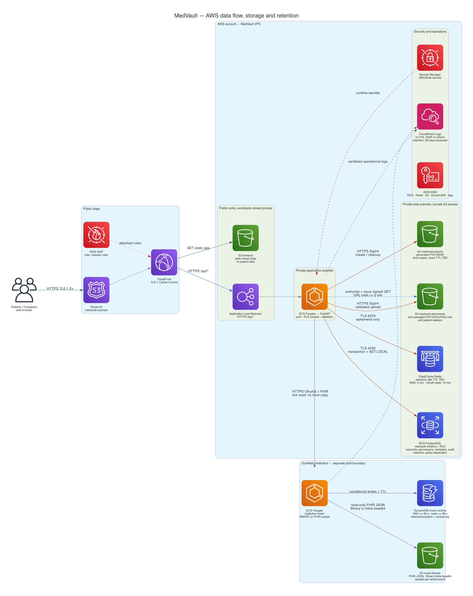

# MedVault — AWS data architecture memory

This file is the repository source of truth for where data lives, how it moves,
and how long it remains there. It follows `MedVault-App-Database-Schema.md`,
`MedVault-Mock-API-Database-Schema.md` from approved PR #5, and Master Test
Plan v2.0.

## Decisive storage rule

MedVault persists only account/permission metadata and self-uploaded documents.
Institutional medical records remain owned by the institution mock, are fetched
live over SMART on FHIR, and are not copied into MedVault PostgreSQL or S3.

The test plan still says “Observation resources ingested” in TC-FUNC-03 and the
E2E flow. That wording conflicts with the newer schema's explicit live-fetch
decision. For this diagram, “ingested” means fetched and rendered, not persisted;
the test plan should be corrected before execution.

## Data location and retention

| Data                                                                                               | AWS service                                                                            | At-rest protection                                                         | Retention / deletion                                                                                                                                                     |
|----------------------------------------------------------------------------------------------------|----------------------------------------------------------------------------------------|----------------------------------------------------------------------------|--------------------------------------------------------------------------------------------------------------------------------------------------------------------------|
| Users, profiles, institution catalogue/connections, caregiver links/permissions, document metadata | RDS PostgreSQL, private subnet, `medvault` schema with FORCE RLS                       | KMS encryption; sensitive metadata additionally encrypted by the app       | Active application lifetime. Account-deletion and legal retention period are still product/compliance decisions.                                                         |
| Self-uploaded PDF/JPEG/PNG                                                                         | Private S3 `medvault-documents` bucket                                                 | SSE-KMS; public access blocked; random object keys                         | Until the patient deletes the document or the account-deletion policy runs. Delete the DB row and S3 object together.                                                    |
| Generated exports                                                                                  | Private S3 `medvault-exports` bucket                                                   | SSE-KMS; public access blocked                                             | Until `data_exports.expires_at`; exact TTL is still TBD. A lifecycle rule and cleanup job must enforce the same value.                                                   |
| Application audit trail                                                                            | RDS PostgreSQL `audit_logs`                                                            | KMS plus append-only DB permissions/triggers                               | Retention is not specified yet. Set it only after the compliance owner decides; never silently delete it.                                                                |
| Session                                                                                            | ElastiCache Redis                                                                      | TLS in transit and KMS at rest                                             | Sliding idle TTL, value TBD; delete on logout/password reset.                                                                                                            |
| SMS verification state                                                                             | ElastiCache Redis                                                                      | TLS/KMS; only code hash stored                                             | 5 minutes, deleted immediately after successful use.                                                                                                                     |
| OAuth state/PKCE/nonce                                                                             | ElastiCache Redis                                                                      | TLS/KMS                                                                    | 10 minutes, deleted immediately after callback/use. IDNP is not included.                                                                                                |
| Rate-limit counters                                                                                | ElastiCache Redis                                                                      | TLS/KMS                                                                    | Endpoint cooldown window, value TBD.                                                                                                                                     |
| Institution access/refresh tokens                                                                  | RDS `institution_connections`, encrypted application-side                              | Ciphertext plus KMS-managed application key                                | Access token until upstream expiry; refresh token until expiry or revocation. Both are wiped on revocation.                                                              |
| IDNP                                                                                               | FastAPI request memory only                                                            | TLS in transit                                                             | One connection request only; never PostgreSQL, Redis, S3, URL, audit or logs.                                                                                            |
| Institutional FHIR resources                                                                       | Institution mock only: private S3 `mock-fixtures`, one JSON collection per institution | SSE-KMS; synthetic data only; institution folders are physically separated | Seeded for the life of the test environment; replaced on reseed. MedVault keeps no copy. `Binary.data` is inline base64 (decoded size ≤5 MB), not a separate PDF object. |
| Mock pushed authorization request                                                                  | DynamoDB `mock-runtime`                                                                | KMS; raw `request_uri` and IDNP are never stored                           | Maximum 90 seconds and single-use; DynamoDB TTL removes expired rows.                                                                                                    |
| Mock authorization code                                                                            | DynamoDB `mock-runtime`                                                                | KMS; only the code hash is stored                                          | Maximum 60 seconds and single-use; exchange uses an atomic conditional update.                                                                                           |
| Mock access/refresh token state                                                                    | DynamoDB `mock-runtime`                                                                | KMS; access-token `jti` and refresh-token hash only                        | Access row until token expiry/revocation; refresh row until expiry/rotation/revocation. Exact lifetimes beyond the schema examples remain policy decisions.              |
| Mock access log                                                                                    | DynamoDB `mock-runtime`, append-only                                                   | KMS; synthetic patient references only; never IDNP                         | Retention is TBD. It must remain long enough to verify minimum scope, IDOR and revocation tests.                                                                         |
| Live FHIR response in MedVault                                                                     | FastAPI/browser memory                                                                 | TLS; `Cache-Control: no-store`                                             | Request/render lifetime only. Do not cache in CloudFront, Redis, PostgreSQL or S3.                                                                                       |
| Operational logs                                                                                   | CloudWatch Logs                                                                        | KMS; structured redaction                                                  | 30 days is the proposed baseline, pending team approval. Never include IDNP, tokens, medical values, signed URLs or file bytes.                                          |
| RDS backups                                                                                        | RDS automated backups/PITR                                                             | KMS                                                                        | 7 days is the proposed MVP baseline, pending team approval and deletion-policy review.                                                                                   |
| React static build                                                                                 | S3 + CloudFront                                                                        | Standard S3 encryption                                                     | Current release plus deploy rollback window; contains no patient data.                                                                                                   |

`TBD` is deliberate: neither the schema nor the test plan defines those periods.
They must not be presented as approved medical-data retention policy.

## Data transmission paths

1. **Browser to MedVault:** HTTPS TLS 1.2+ through Route 53, CloudFront, WAF and
   the Application Load Balancer. CloudFront serves the static React build and
   forwards `/api/*`; authenticated/API responses use `Cache-Control: no-store`.
2. **FastAPI to PostgreSQL:** TLS on the private network. Each authenticated
   request opens a transaction and executes `SET LOCAL app.current_user_id`;
   FORCE RLS returns zero patient rows when context is missing.
3. **FastAPI to Redis:** TLS on the private network. Redis contains ephemeral
   coordination/authentication state, never medical records or uploaded files.
4. **Self-upload:** browser streams the file to FastAPI; FastAPI checks size,
   magic bytes and content validity before writing it to S3 with SigV4. Metadata
   and the opaque S3 object key are written to PostgreSQL.
5. **View original:** FastAPI checks RLS plus `can_view_original`, audits the
   attempt, and returns a private S3 signed URL valid for no more than five
   minutes. The browser then downloads directly from S3 over HTTPS.
6. **Institution connection:** IDNP travels server-to-server in the pushed
   authorization request and exists only in request memory. OAuth secrets come
   from Secrets Manager; tokens are encrypted before PostgreSQL storage.
7. **Institutional category view:** FastAPI checks the current connection and
   caregiver category permission, fetches FHIR data live over HTTPS, audits the
   fetch, and returns it with `no-store`. No MedVault persistence occurs.
   `GET /Binary/{id}` is authorized through its `securityContext`; the mock
   decodes the fixture's inline base64 and streams PDF/JPEG/PNG bytes.
8. **Export:** the backend reads authorized local metadata/files and live FHIR,
   writes one expiring object to the export bucket, and records `expires_at` in
   PostgreSQL. Cleanup and S3 lifecycle delete the object after that deadline.

## Trust and network boundaries

- RDS and ElastiCache have no public endpoint and accept traffic only from the
  FastAPI security group.
- S3 buckets block public access. The frontend bucket is readable only through
  CloudFront Origin Access Control; medical buckets are accessed using IAM roles
  and short-lived signed download URLs.
- ECS tasks use IAM task roles; static AWS keys are not stored in environment
  files or container images.
- Secrets Manager stores database and OAuth secrets. KMS protects RDS, Redis,
  S3, Secrets Manager and CloudWatch data at rest.
- The institution mock is a separate trust boundary. Its S3 bucket contains
  synthetic JSON fixtures only; production patient data must never be seeded
  there. DynamoDB contains only the mock's mutable OAuth/test state.
- Application audit records stay in PostgreSQL. CloudWatch is operational
  telemetry, not the medical audit source of truth.

## Test-plan alignment

- TC-SEC-01/05: FORCE RLS plus transaction-scoped `SET LOCAL` fails closed and
  cannot leak identity through a reused connection.
- TC-SEC-02: patient identity comes from session/token context, never a trusted
  request parameter.
- TC-SEC-03/04: authorization codes are one-use and short-lived in the mock.
- TC-SEC-06..09: uploads are validated before persistent S3 storage.
- TC-SEC-10: caregiver permission is read from PostgreSQL on every request.
- TC-SEC-11: revocation wipes local tokens and revokes upstream access.
- TC-SEC-12: WAF handles coarse IP limits; Redis handles account/endpoint limits.
- TC-FUNC-07: sensitive access produces an append-only PostgreSQL audit record.

## Decisions still required

1. Session idle timeout.
2. Export expiry (24 hours is a reasonable MVP proposal, not yet approved).
3. Audit-log retention and account-deletion/legal-hold behavior.
4. RDS backup retention and whether deletion must propagate into backups.
5. Rate-limit thresholds/cooldown windows.
6. Whether caregivers may upload (`can_upload` exists, but no story grants it).
7. Mock access-log retention and concrete access/refresh-token lifetimes.

## AWS mapping of the mock schema

The approved mock schema deliberately leaves storage open: plain JSON files are
the simplest option, while runtime OAuth records need a writable store. D3 maps
that contract to AWS without changing it:

- `data/{institution_id}/{Collection}.json`, `_shared` and immutable OAuth
  client configuration → private S3 `mock-fixtures`;
- `PushedAuthorizationRequest`, `AuthorizationCode`, `AccessToken`,
  `RefreshToken` and append-only `AccessLog` → DynamoDB `mock-runtime`;
- one-use OAuth operations → DynamoDB conditional writes, avoiding a
  read-then-write replay race;
- expiry → DynamoDB TTL for cleanup, while request handling still checks
  `expiresAt` synchronously because TTL deletion is not immediate.
