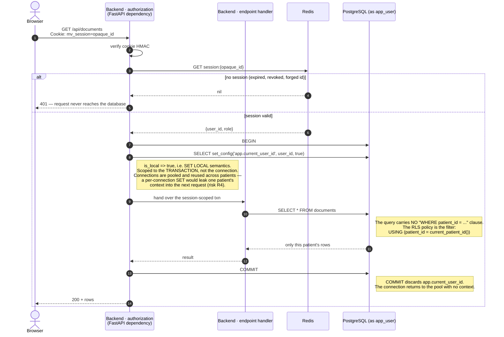
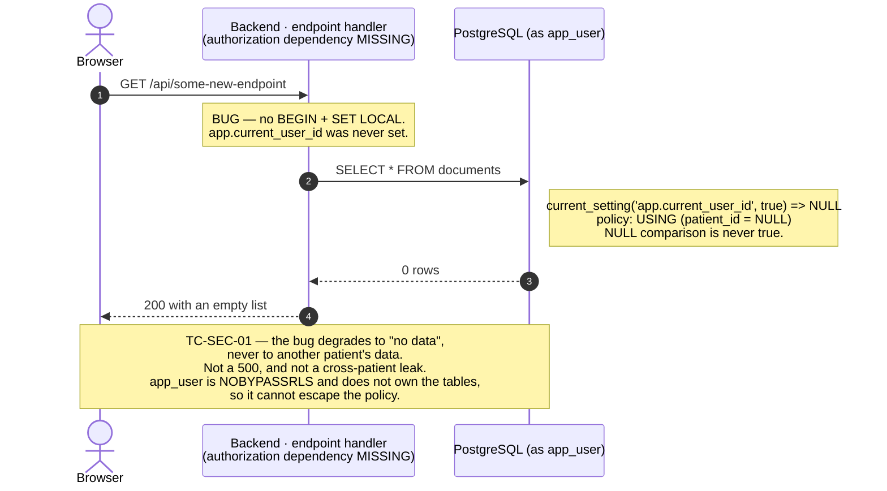

# S2 — Authorized request under Row-Level Security

> **The most important flow in the system.** Every other authenticated request
> is a special case of this one.

**Spec:** ADR-02 (authorization enforced by PostgreSQL RLS, fail-closed when the
context is missing), R1 and R4 in §6 (omitted middleware; connection recycled
from the pool without resetting the context).



## The fail-closed branch — test **TC-SEC-01**

A new endpoint is added and the author forgets the `authorization` dependency
(risk **R1**). The request still reaches the database, but with no context set.



**What TC-SEC-01 asserts:** query a patient-data table as `app_user` with no
`app.current_user_id` set, and get exactly zero rows while the same rows are
visible to a role that bypasses RLS. Failing open — any row count above zero —
is a release blocker.

Run it against a live stack:

```bash
curl -s http://localhost/api/_rls/selftest
```

## Why fail-closed rather than an error

Raising an exception on a missing context would also be safe, but it depends on
application code remembering to check. The RLS policy is evaluated by the
database engine on every query, including queries written by code that has
never heard of the check. Zero rows is the weakest outcome that is still safe,
and it needs no cooperation from the caller — which is the whole point of
ADR-02.
