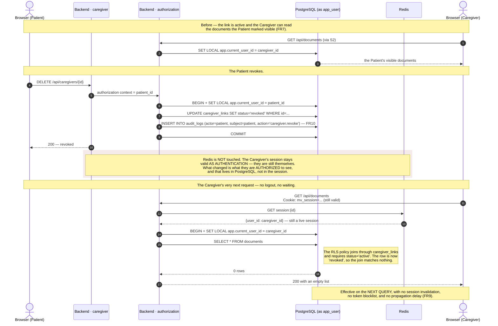

# S4 — Caregiver revocation takes effect immediately

**Spec:** FR6 (invitation states pending / active / revoked), FR7 (Caregiver
sees only what the Patient marked visible), FR9 (revocation is effective
immediately), FR10 (audit entry), ADR-01, ADR-02.

The interesting part is what the system does **not** do: it does not touch the
Caregiver's Redis session.

## Why this is not a JWT with an embedded role — ADR-01

If the Caregiver's permissions travelled inside a signed token, the token issued
*before* the revocation would keep asserting them until it expired. Making that
safe requires a server-side blocklist checked on every request — which is a
session store with extra steps, and it discards the stateless property that was
the only reason to choose JWT in the first place.

By keeping the session as an opaque id and the *permissions* in the database,
the authorization decision is re-evaluated by the RLS policy on every single
query. There is no window during which a stale credential still works.

| | Session (Redis) | Permission (PostgreSQL) |
|---|---|---|
| Answers | "who is this?" | "what may they see?" |
| Changed by revocation | no | yes |
| Re-checked | once per request | on every query, by the engine |

This is the same mechanism as FR5 (institution disconnect) and the reason
S2's fail-closed behaviour matters: revocation and a missing context converge on
the same safe result — zero rows.
