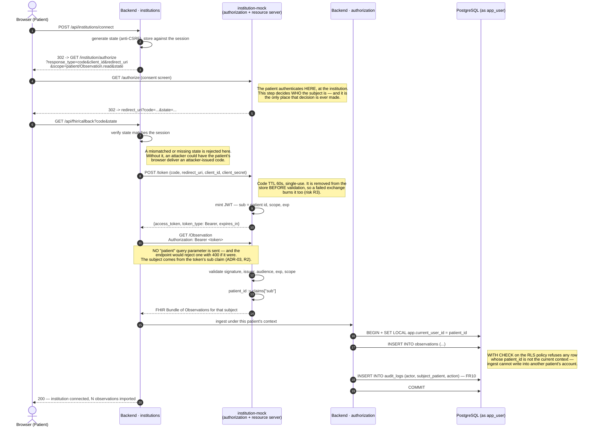
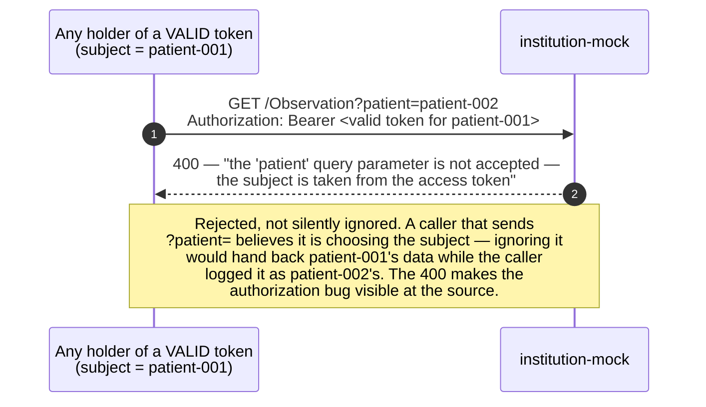
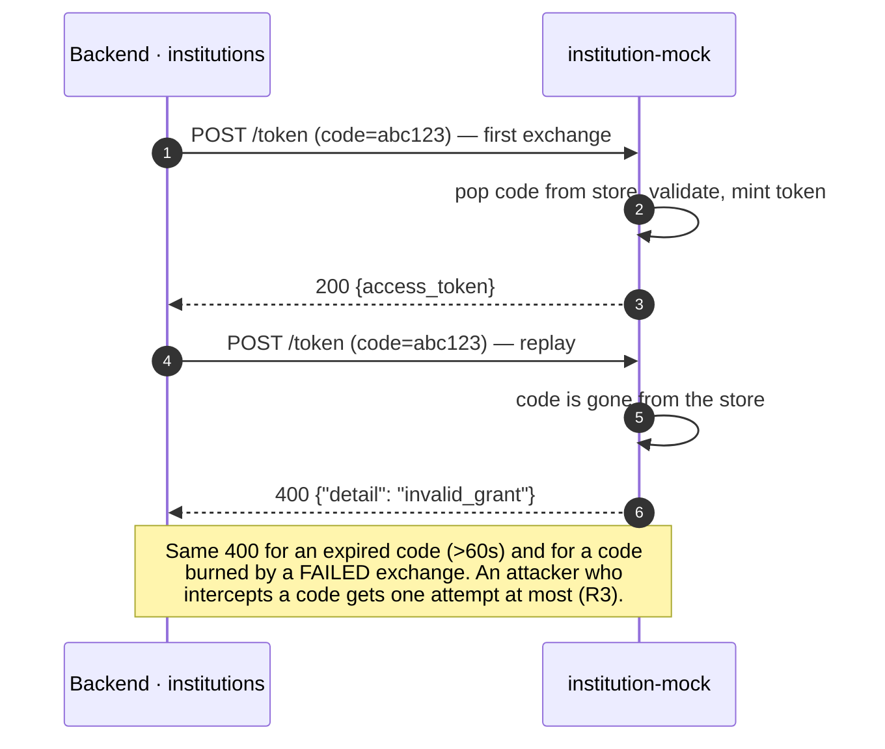

# S3 — Connecting an institution (OAuth2 / SMART on FHIR subset)

**Spec:** FR3 (OAuth2 consent flow), FR4 (Observations ingested on success),
FR10 (audit entry), ADR-03 (simulated institution, patient id taken from the
token claim), R2 (IDOR), R3 (intercepted authorization code).

This is the **only** flow in MedVault where a JWT exists. It is a
server-to-server access token, never a user session (ADR-01).

## The IDOR that this design removes

## Replayed authorization code

## Revocation (FR5)

Disconnecting an institution deletes the stored connection and its tokens. The
short access-token lifetime bounds the window; nothing that was ingested is
retroactively hidden, because those Observations now belong to the patient's own
record and are governed by the same RLS policies as everything else.
