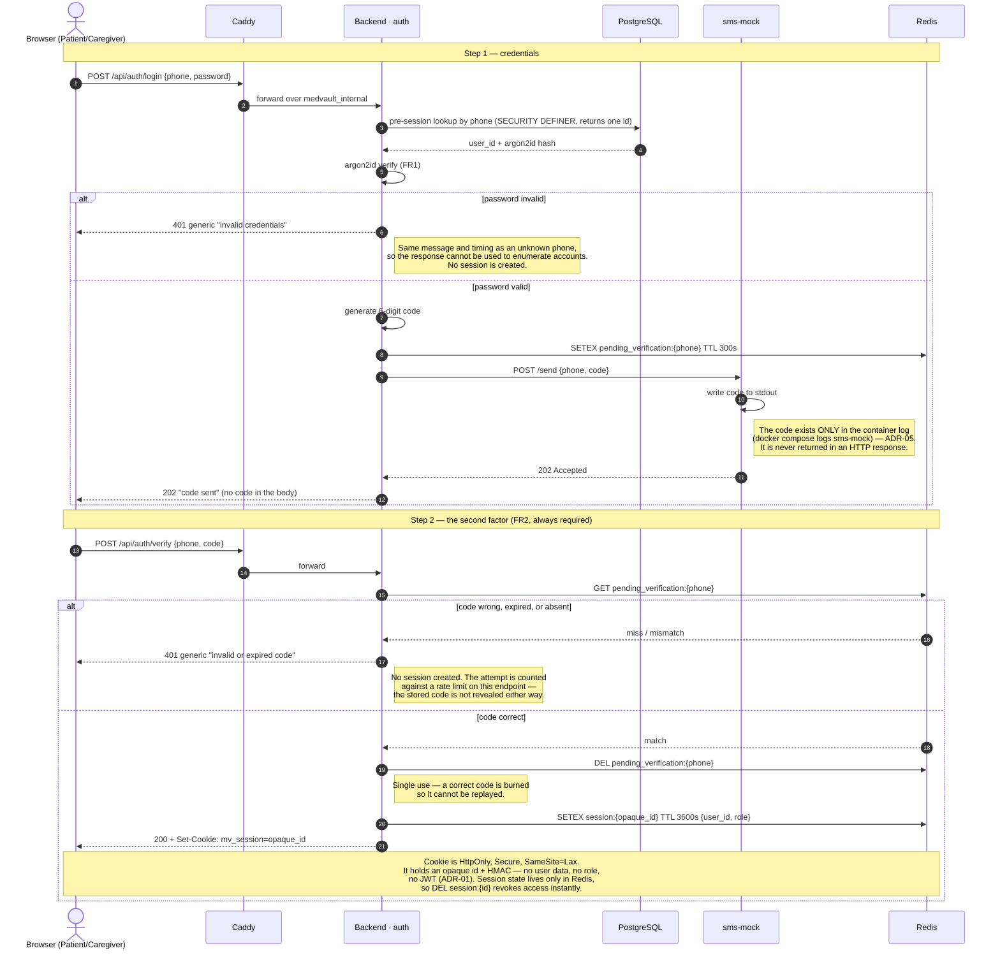

# S1 — Login with mandatory SMS verification

**Spec:** FR1 (argon2id password hash), FR2 (SMS code on *every* sign-in, a
mandatory second factor — not optional), ADR-01 (server-side session in Redis),
ADR-05 (sms-mock; the code exists only in the container log).

No JWT appears anywhere in this flow. The cookie carries an opaque session id
and nothing else.

## Why it is shaped this way

- **The code never leaves the server as data.** `POST /auth/start` responds
  `202` with no code in the body. The only readable copy is the sms-mock log.
  A network attacker who can read responses still cannot log in.
- **Both failure branches return the same shape of answer.** Wrong password and
  wrong code both produce a generic message, so neither can be used to discover
  which phone numbers are registered.
- **The cookie is opaque.** Putting the role in a JWT would make revocation
  (FR9, and S4) impossible without a blocklist — the alternative ADR-01
  explicitly rejects.
